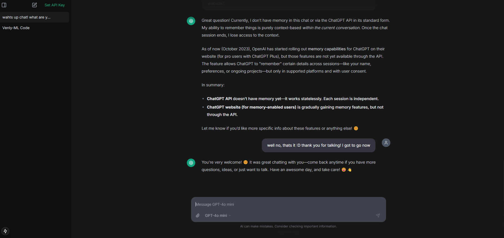

# API GPT

A sleek, local chat interface that connects directly to OpenAI's API. Use premium OpenAI models without a ChatGPT Plus subscription - pay only for what you use through OpenAI's API pricing.



## Features

- Direct connection to OpenAI's API
- Local chat history storage
- Support for multiple OpenAI models
- Clean, modern interface inspired by ChatGPT
- File upload support
- Markdown & code syntax highlighting
- Mobile responsive

## ⚠️ Important Note About Costs

This application uses your OpenAI API credits. **You will be charged based on OpenAI's pay-as-you-go pricing**. Make sure to:

1. Monitor your usage at [OpenAI's usage dashboard](https://platform.openai.com/usage)
2. Set up usage limits at [OpenAI's billing settings](https://platform.openai.com/account/billing/limits)
3. Check current pricing at [OpenAI's pricing page](https://openai.com/pricing)

## Installation

```bash
# Clone the repository
git clone https://github.com/nejcpetan/api-gpt.git

# Navigate to the project directory
cd api-gpt

# Install dependencies
npm install

# Start the development server
npm run dev
```

## Setup

1. Get your OpenAI API key from [OpenAI's platform](https://platform.openai.com/api-keys)
2. Launch the application
3. Click the "Set API Key" button
4. Enter your OpenAI API key
5. Start chatting!

Your API key is stored locally in your browser and is only sent to OpenAI's API.

## Available Models

Currently supported models:
- GPT-4o (gpt-4-0613)
- GPT-4o-mini (gpt-4-0125-preview)
- GPT-o1 (gpt-4-1106-preview)
- GPT-o1-mini (gpt-4-turbo-preview)

To add or modify models, edit `lib/constants.ts`:

```typescript
export const AVAILABLE_MODELS = [
  {
    id: "gpt-4o",
    name: "GPT-4o",
    alias: "gpt-4-0613"
  },
  {
    id: "gpt-4o-mini",
    name: "GPT-4o mini",
    alias: "gpt-4-0125-preview"
  },
  {
    id: "gpt-o1",
    name: "GPT-o1",
    alias: "gpt-4-1106-preview"
  },
  {
    id: "gpt-o1-mini",
    name: "GPT-o1 mini",
    alias: "gpt-4-turbo-preview"
  }
] as const
```

## Usage

1. Start a new chat by typing in the message box
2. Switch between models using the model selector at the bottom left
3. Upload files using the paperclip icon
4. Edit chat titles by hovering over them in the sidebar
5. Delete chats using the trash icon
6. Toggle the sidebar using the menu button

## Technical Details

- Built with Next.js 15
- Uses Zustand for state management
- Implements streaming responses
- Stores chat history in local JSON files
- Uses shadcn/ui components
- Styled with Tailwind CSS

## Limitations

- Currently only supports OpenAI models
- File uploads are temporary (cleared on server restart)
- No conversation branching
- No export/import functionality yet

## Contributing

Pull requests are welcome! For major changes, please open an issue first to discuss what you would like to change.

## Support

If you encounter any issues or have questions, please open an issue on GitHub.
